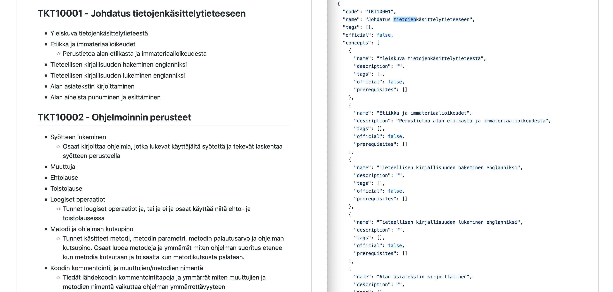

# concepts-markdown-to-json

- Goal: Easily write concepts of courses with a text editor
- Solution: Markdown to json script

## Example



## Usage

### To JSON

See [courses.md](courses.md) for an example markdown file

Turn it into json:

```
node toJSON.js
```

Note: Please update these variables from `toJSON.js` according to your files!

```
const WORKSPACE_NAME = 'menetelmätieteet'
const INPUT_FILE = 'courses.md'
const OUTPUT_FILE = 'output.json'
```

See [output_sample.json](output_sample.json) for example json

### To Markdown

You can turn existing json into markdown:

```
node toMarkdown.js
```

Again: update filename variables in `toMarkdown.js`

### Import in application

Use the import feature to use your json in the concepts app

### Note

These scripts support only following information:
- courses
- course codes
- concept names
- concepts descriptions

Other information (prequisites etc) in the json is ignored.

## Markdown format

Rules:
- Include a document header before first course header. For exaple `# CS courses`
- Course header prefixed with `'## '` (without the `'`s)
- Course header includes the `course code` and `course name` splitted with `' - '`
- Concepts of the course given as a markdown list.
- Each concept may have one line on description right below it. Indent with 2 spaces.
- One empty line before and after concepts.
- If there are no concepts, leave one empty line.
